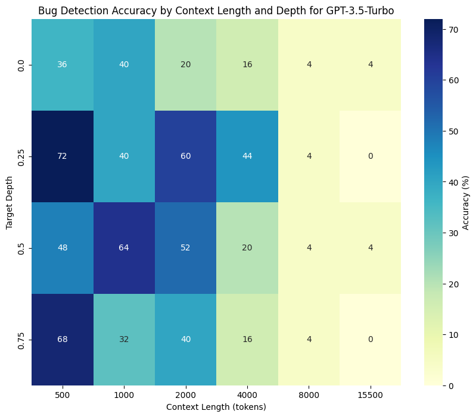

# Bug In The Code Stack


A new benchmark for measuring LLM's capability to detect bugs in large codebase.

### About

- Similar to the [Needle In The Haystack](https://github.com/gkamradt/LLMTest_NeedleInAHaystack) benchmark, the Bug In The Haystack benchmark utilizes Python source code (randomly assembled) as the background noise and syntactic bug as the needle.
- This allows measurement of LLM's capability to retrieve code-related information at a very large context window, which is useful for SWE agent and co-pilot applications.

### Example

```python
1 | def fahrenheit_to_celsius(fahrenheit):
2 |   return (fahrenheit - 32) * 5.0/9.0
3 |
4 | def is_prime(num:
5 |     if num <= 1:
6 |         return False
7 |     for i in range(2, int(num**0.5) + 1):
8 |         if num % i == 0:
9 |             return False
10|     return True
Answer: 4, missing_parenthesis
```

### Results

> GPT-3.5-Turbo



### Notebooks

- `notebooks/bug_in_the_code_stack_python_source_code_preprocessing.ipynb` contains Colab notebook for data processing.
- `notebooks/bug_in_the_code_stack_experiment_openai.ipynb` contains Colab notebook for running the experiment on OpenAI models.

### Dataset

- `datasets/bug_in_the_code_stack_alpaca_dataset.csv` is the preprocessed dataset used for the experiment.

### Google Drive

- All notebooks and datasets can also be found at [Bug In The Code Stack Google Drive](https://drive.google.com/drive/folders/10rakicr-iQ-zIY8SwllAVawgUWqN9roE). If you don't have access, please request access to `techandy42@gmail.com`. 
