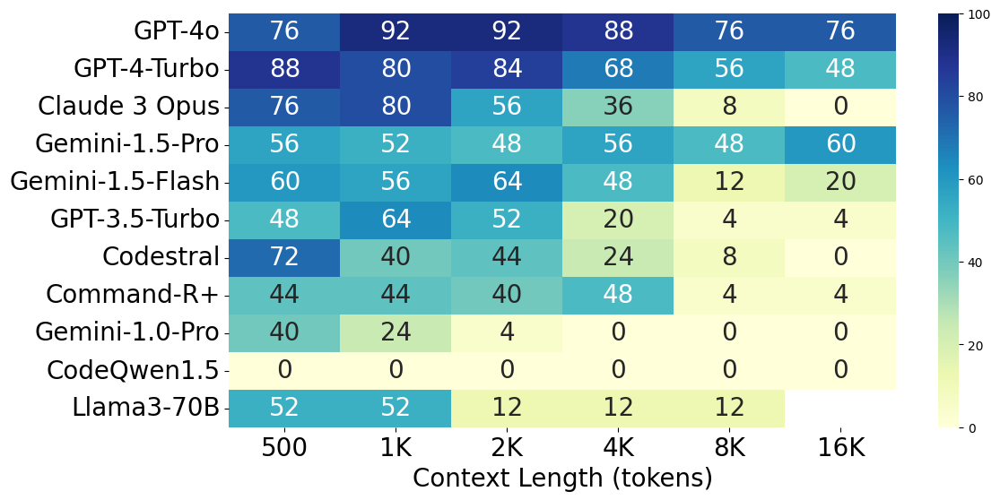
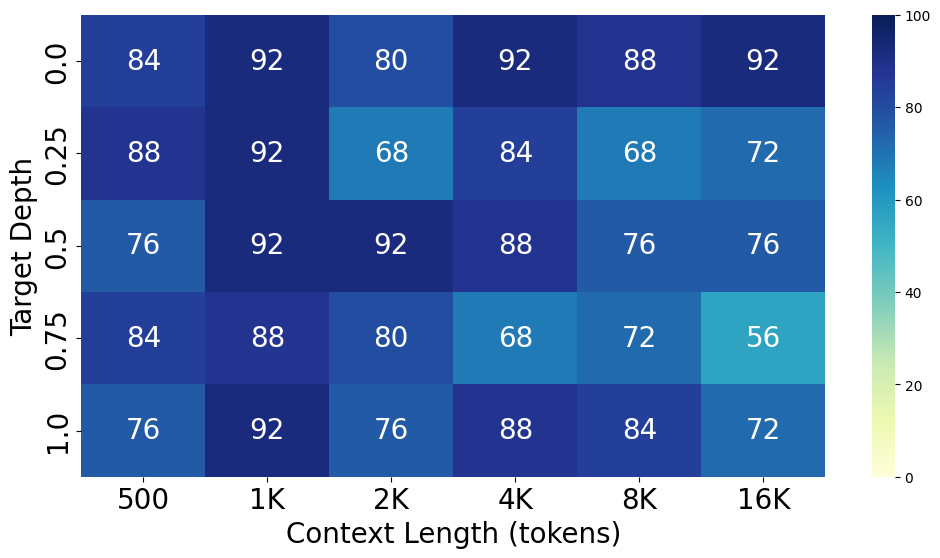
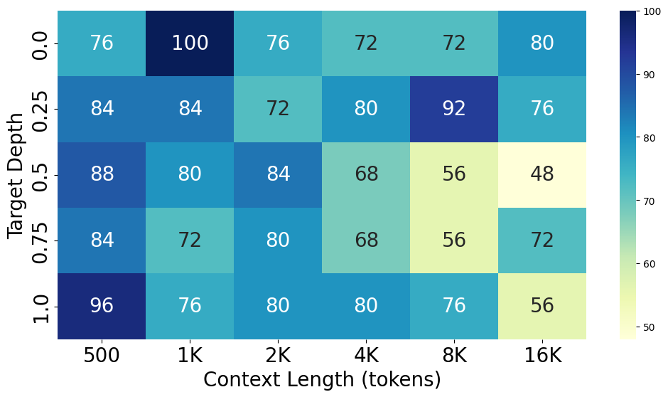
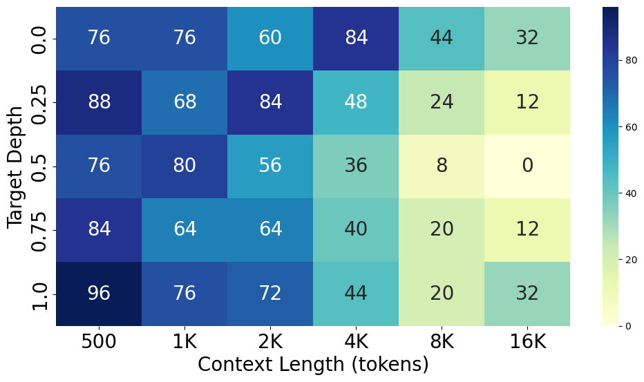
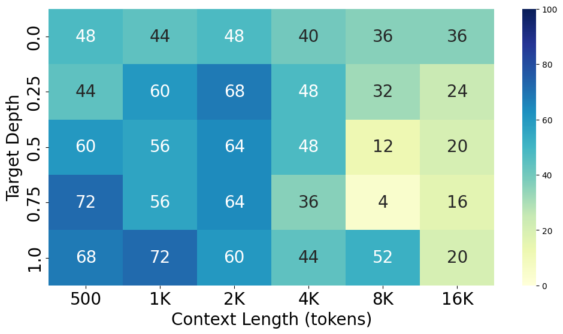
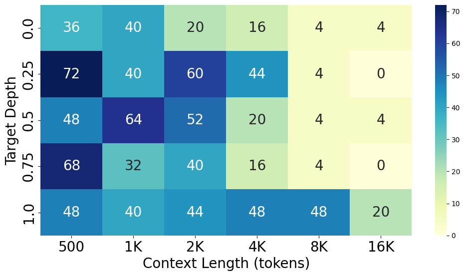
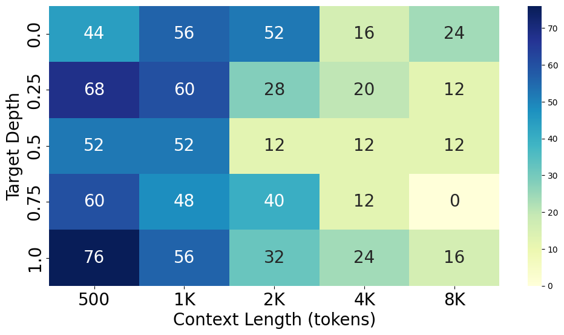
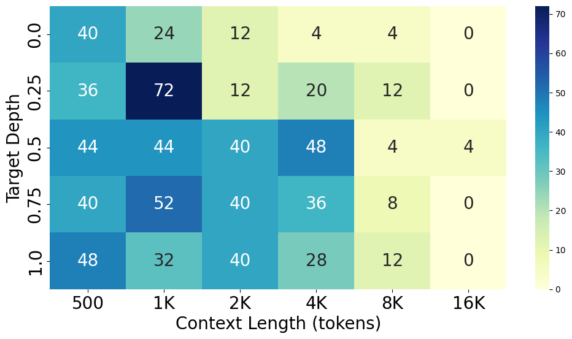
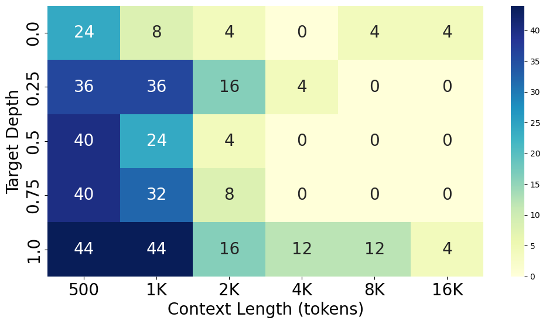
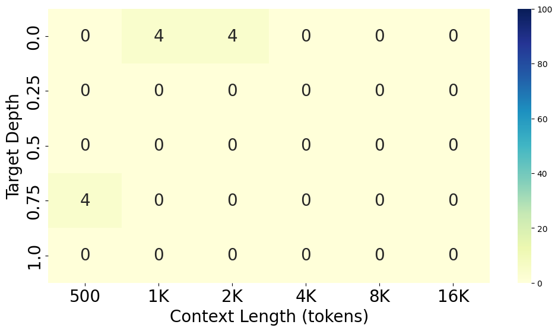

# Bug In The Code Stack


A new benchmark for measuring LLM's capability to detect bugs in large codebase.

### About

- Similar to the [Needle In The Haystack](https://github.com/gkamradt/LLMTest_NeedleInAHaystack) benchmark, the Bug In The Haystack benchmark utilizes Python source code (randomly assembled) as the background noise and syntactic bug as the needle.
- This allows measurement of LLM's capability to retrieve code-related information at a very large context window, which is useful for SWE agent and co-pilot applications.

### Example

```python
1 | def fahrenheit_to_celsius(fahrenheit):
2 |   return (fahrenheit - 32) * 5.0/9.0
3 |
4 | def is_prime(num:
5 |     if num <= 1:
6 |         return False
7 |     for i in range(2, int(num**0.5) + 1):
8 |         if num % i == 0:
9 |             return False
10|     return True
Answer: 4, missing_parenthesis
```

### Results

- *All models were evaluated on their latest versions.

> Comparison (Target Depth @ 0.5)



> GPT-4o



> GPT-4-Turbo



> Claude 3 Opus



> Gemini 1.5 Pro


> Gemini 1.5 Flash



> GPT-3.5-Turbo



> Codestral


> Llama3-70B



> Command-R+



> Gemini-1.0-Pro



> CodeQwen1.5 (Zero-Shot)



### Notebooks

- `notebooks/bug_in_the_code_stack_python_source_code_preprocessing.ipynb` contains Colab notebook for data processing.
- `notebooks/bug_in_the_code_stack_experiment_openai.ipynb` contains Colab notebook for running the experiment on OpenAI models.
- `notebooks/bug_in_the_code_stack_experiment_litellm_openai_gpt4.ipynb` contains Colab notebook for running the experiment on GPT-4 w/t LiteLLM.
- `notebooks/bug_in_the_code_stack_experiment_litellm_openai_gpt35.ipynb` contains Colab notebook for running the experiment on GPT-3.5 w/t LiteLLM.
- `notebooks/bug_in_the_code_stack_experiment_litellm_anthropic_claude3.ipynb` contains Colab notebook for running the experiment on Claude 3 Opus w/t LiteLLM.
- `notebooks/bug_in_the_code_stack_experiment_litellm_cohere_commandr.ipynb` contains Colab notebook for running the experiment on Command-R+ w/t LiteLLM.
- `notebooks/bug_in_the_code_stack_experiment_litellm_meta_llama3.ipynb` contains Colab notebook for running the experiment on Llama3 70B w/t LiteLLM.
- `notebooks/bug_in_the_code_stack_experiment_mistral_codestral.ipynb` contains Colab notebook for running the experiment on Mistral Codestral w/t LiteLLM
- `notebooks/bug_in_the_code_stack_experiment_qwen_codeqwen_local.ipynb` contains Colab notebook for running the experiment on CodeQwen1.5 locally. Make sure to run this on Colab with A100 GPU.
- `notebooks/bug_in_the_code_stack_experiment_genai_gemini10.py` contains Python script for running the experiment on Gemini-1.0-Pro w/t Generative AI package. Make sure to run this locally (doesn't work on Colab).
- `notebooks/bics_helper_result_graphs.ipynb` contains helper functions to create beautiful graphs.
- `notebooks/bics_result_analysis_graphs.ipynb` contains code to analyze the properties of codegen-focused models compared to larger, general-purpose models.

### Dataset

- `datasets/bug_in_the_code_stack_alpaca_dataset.csv` is the preprocessed dataset used for the experiment.

### Google Drive

- All notebooks and datasets can also be found at [Bug In The Code Stack Google Drive](https://drive.google.com/drive/folders/10rakicr-iQ-zIY8SwllAVawgUWqN9roE). If you don't have access, please request access to `techandy42@gmail.com`. 
